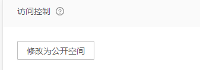

::: warning 某一个微服务需要对接七牛云的对象存储

:::

##### 设置的是私有存储空间



##### 官方提供的下载sdk如下

```java
String fileName = "公司/存储/qiniu.jpg";
String domainOfBucket = "http://devtools.qiniu.com";
String encodedFileName = URLEncoder.encode(fileName, "utf-8").replace("+", "%20");
String publicUrl = String.format("%s/%s", domainOfBucket, encodedFileName);

String accessKey = "your access key";
String secretKey = "your secret key";
Auth auth = Auth.create(accessKey, secretKey);
long expireInSeconds = 3600;//1小时，可以自定义链接过期时间
String finalUrl = auth.privateDownloadUrl(publicUrl, expireInSeconds);
System.out.println(finalUrl);

```

##### 上传是没啥问题的主要就是私有空间下载链接显示token失效的问题

```json
{"error":"download token auth failed"}
```

##### 搞来搞去换了access key 换了其他sdk 都不行，最后提交工单问才知道必须要绑定域名才能使用私有空间的的下载服务 

#### 这个故事告诉我们，不是自己写的东西最好先问