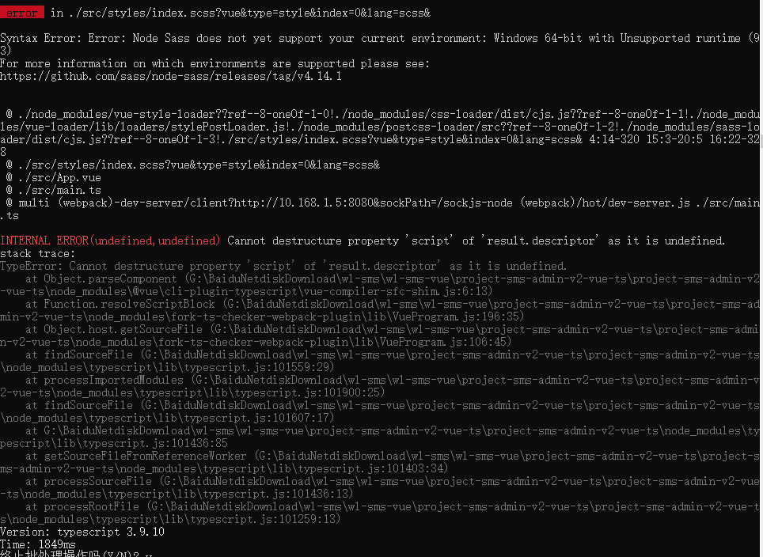
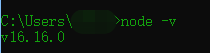

::: tip

最近新拉了个项目，前端一编译就各种报错。（报了50个,非常恐怖）

这肯定不是代码的问题,虽然说报的都是那个包哪一行样式或者js变量啥的。

一般来说都是包依赖的问题

:::

##### 翻了很久日志 翻到了这个错误,立刻就懂了。 是我node.js版本太新了

#### 

:::danger

赶紧看下版本 果然

#### 

:::

##### 最后打开项目修改package.json，然后npm update + npm install 完成

```json
 "node-sass": "^6.0.1",
 "sass-loader": "^10.0.1",
```

