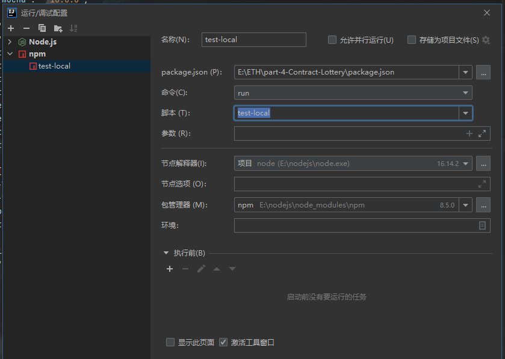

<!-- more -->

::: tip

最近尝试着使用IDEA进行hardhat框架下的web3.js编写，主要是因为Vscode写js不好写，比如没有类型检查、补全代码、检查错误还得设置checkJS之类的。但是呢Vscode有javascript debug termimal，这个倒是挺好用的。

主要是即时输入脚本就能对所产生的一系列操作打断点调试，这个确实有点强。

IDEA也可以就是有点麻烦，如下：

:::

#### 首先IDEA需要进行NPM DEBUG需要先在package.json中定义好脚本：

```json
  "scripts": {
        "deploy-local": "yarn hardhat deploy --network localnetwork",
        "deploy-testnet": "yarn hardhat deploy --network Goerli",
        "test-local": "yarn hardhat test --network localnetwork",
        "test-staging": "yarn hardhat test --network Goerli",
        "lint": "yarn solhint 'contracts/*.sol'",
        "lint-fix": "yarn solhint 'contracts'/*.sol --fix ",
        "format": " yarn prettier --write ."
    }
```

#### 然后编辑DEBUG配置如下图：



#### 然后在脚本对应操作的js文件中打断点即可