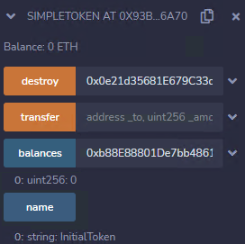

<!-- more -->

::: tip

目前来看最全面的智能合约安全靶场:+1:

https://ethernaut.openzeppelin.com/ 

浏览器控制台 help()指令


:::

#### 第十七 / 十八关 Recovery / MaginNumber思路与POC

##### 先看第一个合约代码:

##### 目标: 部署者使用Recovery合约生成了SimpleToken之后又转账了0.01ETH到SimpleToken合约,但是他忘记了SimpleToken合约的地址,找回该地址/或摧毁SimpleToken

```solidity
// SPDX-License-Identifier: MIT
pragma solidity ^0.8.0;

contract Recovery {

  //generate tokens
  function generateToken(string memory _name, uint256 _initialSupply) public {
    new SimpleToken(_name, msg.sender, _initialSupply);
  
  }
}

contract SimpleToken {

  string public name;
  mapping (address => uint) public balances;

  // constructor
  constructor(string memory _name, address _creator, uint256 _initialSupply) {
    name = _name;
    balances[_creator] = _initialSupply;
  }

  // 一个ETH等于10 SimpleToken
  receive() external payable {
    balances[msg.sender] = msg.value * 10;
  }

  // allow transfers of tokens
  function transfer(address _to, uint _amount) public { 
    require(balances[msg.sender] >= _amount);
    balances[msg.sender] = balances[msg.sender] - _amount;
    balances[_to] = _amount;
  }

  // clean up after ourselves
  function destroy(address payable _to) public {
    selfdestruct(_to);
  }
}
```

##### poc思路:point_right:：在区块链网络之上一切都是不可篡改的被记录交易:record_button: ,所以即使此处我们忘记了SimpleToken的地址.但是我们还是可以根据Recovery合约地址以及其所产生的交易查询部署者所做的交易.


```js
/*
某人 -transfer 0.001ETH-> 0xb4b157c7c4b0921065dded675dfe10759eecaa6d(部署者地址) -transfer 0.001ETH-> SimpleToken合约地址
*/
 Contract 0xd2e5e0102e55a5234379dd796b8c641cd5996efd 
 TRANSFER  0.001 Ether From 0xd2e5e0102e55a5234379dd796b8c641cd5996efd To  0xb4b157c7c4b0921065dded675dfe10759eecaa6d
 TRANSFER  0.001 Ether From 0xb4b157c7c4b0921065dded675dfe10759eecaa6d To  0x93b768ef876fe701d36611f1640b645ceb06a70e
```

##### 综上所得:仅需要在REMIX-IDE中选择合适的网络,复制SimpleToken源代码和地址 then 导入合约 ,我们就得到了SimpleToken合约.then调用destoty方法即可.



#### 看第二个合约代码:  

##### 目标: 部署 MagicNum合约时发送数据,但要求大小最多为10字节 :open_mouth:

```solidity
// SPDX-License-Identifier: MIT
pragma solidity ^0.8.0;

contract MagicNum {

  address public solver;

  constructor() {}

  function setSolver(address _solver) public {
    solver = _solver;
  }
}
```

##### poc思路:point_right: : 要准确的存入确定大小单位为字节的数据就只能调整传入值的内存数据

```assembly
push1 0x2a //内存地址0x2a位置中的值
push1 0x80 //任意选择一个内存位置0x80 -> slot80
MSTORE // 将 0x2a内存地址的值 到 位置 0x80

push1 0x20 //总数据大小0x20 32字节
push1 0x80
RETURN //返回 0x80 中长度 0x20的数据
//最终得到运行时操作码 60 2a 60 80 52 60 20 60 80 f3 (60为push操作,52为MSTORE操作,f3为返回操作)

//初始化运行时操作码
push1 0x0a //运行时操作码大小 0a 10字节
push1 0x?? //运行时操作码位置未知 占位符
push1 0x00 // 任意选择位置运行 运行时操作码
CODECOPY // 复制到运行时操作码到内存

push1 0x0a  //运行时操作码数据 0a 10字节
push1 0x00 //0x00位置
RETURN //返回数据到slot0
//最终得到初始化运行时操作码 600a600c600039600a6000f3
//所以最终序列化操作码为 602a60805260206080f3 + 600a600c600039600a6000f3
```

```solidity
//发送数据并创建新合约
await sendTransaction({from:player,data:'0x602a60805260206080f3600a600c600039600a6000f3'} ,  (err, res) => {console.log(res)})
await contract.setSolver('new contract address')
```

