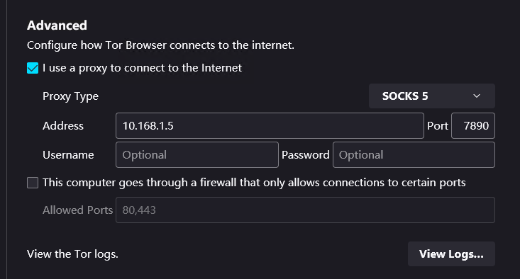

::: tip 

网络环境不允许的情况下,一般是无法连接到tor入口节点或者网桥的.

但是呢TOR浏览器一般可以设置流量走向. 如下：



:::

#### 可是brave并没有这个设置,那么怎么办呢？

其实和配置tor路由节点或者隐藏服务一样,客户端也一样有torrc配置文件

brave浏览器捆绑的tor配置文件在如下目录：

C:\Users\you user name\AppData\Local\BraveSoftware\Brave-Browser\User Data\cpoalefficncklhjfpglfiplenlpccdb\1.0.29\tor-torrc

打开tor-torrc文件加上如下配置即可

```bash
Socks5Proxy 10.168.1.5:7890
```

