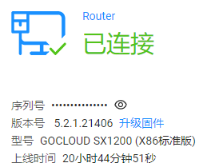

::: tip  软路由版本为最新
#### 

:::

::: tip 
最近注册了个国外的ddns服务 dynu 他的更新地址接口是这样的： 
Non SSL: http://api.dynu.com/nic/update?hostname=example.dynu.com&password=PASSWORD
SSL Format: https://api.dynu.com/nic/update?hostname=example.dynu.com&password=PASSWORD  

Non SSL: http://api.dynu.com/nic/update?username=USERNAME&password=PASSWORD
SSL Format: https://api.dynu.com/nic/update?username=USERNAME&password=PASSWORD
:::
::: tip
#### 高恪的是这样的
:::

::: warning
我想直接用密码更新的那个api,因为我当时也刚睡醒顺手就往高恪配置栏里的用户名一栏填了个""。 
哦豁 一填就gg 所有自定义配置都消失了
:::

::: tip
然后我刷新下想看看路由器到底有没有响应  
看下图明明是有的但就是不显示到页面。 （cfgXXXXX就是动态路由的配置页面）
:::

::: tip
我顺手找了个提交请求,想重新post一下看能不能改回来
:::

::: warning 最后
emmmmm 路由器根本不鸟我 可能是哪个参数错了  
想去github上看看高恪有没有开源,结果也没有,看来要解决这个问题只能重置路由器了
:::

